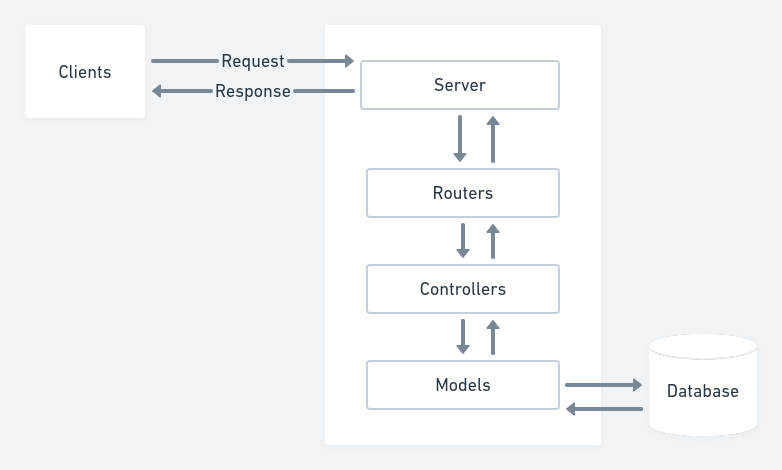
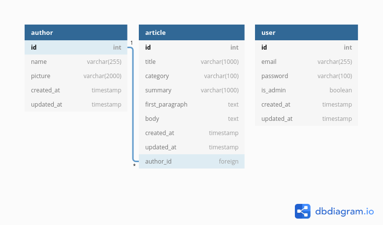

# Jungle Devs - Solution

## Project description
The architecture of this project consists of a REST API for registering and reading articles from authors. The components architecture is represented in the following diagram:



The Database contains three tables: author, article, user. 



The API documentation can be viewed at:
- [API schema](api-schema.yaml)
- [API schema hosted online at SwaggerHub](https://app.swaggerhub.com/apis/alicefng/newsApi/1.0.0)

Some endpoints are public, while other are private (admins or logged users can access).

## Instructions

- This project uses Node.js v12.20.0, yarn, and Docker Compose.

- Clone the repository: `https://github.com/alicefrancener/node-challenge-001` 
- Change the `.env.example` to `.env` and update the environment varibles in production
- Install dependencies: `yarn`
- Run docker compose: `sudo docker-compose up`
  - Database will run by default at port: 5432
  - Database Adminer will run by default at port: 8080
    - To access adminer, use the same variables defined in `docker-compose.yml` for the database
- Start application: `yarn dev`
  - Application will run by default at port: 3333
- Run database migrations: `yarn db:migrate`
- [optional] Seed the database: `yarn db:seed`
- [optional] Run tests: `yarn test`
- [optional] Run tests with coverage: `yarn test:coverage` (the coverage reports will be placed in a directory called `/coverage`)

# Jungle Devs - Node Challenge #001

## Description

**Challenge goal**: The purpose of this challenge is to give an overall understanding of a backend application. You’ll be implementing a simplified version of news provider API. The concepts that you’re going to apply are:

- REST architecture;
- Authentication and permissions;
- Data modeling and migrations;
- SQL database;
- Query optimization;
- Serialization;
- Production builds.

**Target level**: This is an all around challenge that cover both juniors and experience devs based on the depth of how the concepts were applied.

**Final accomplishment**: By the end of this challenge you’ll have a production ready API.

## Acceptance criteria

- Clear instructions on how to run the application in development mode
- Clear instructions on how to create production builds
- A good API documentation or collection
- Models created using [Objection.js](https://vincit.github.io/objection.js/)
- Login API: `/api/login`
- Sign-up API: `/api/sign-up`
- Administrator restricted APIs:
  - CRUD `/api/admin/authors`
  - CRUD `/api/admin/articles`
- List article endpoint `/api/articles?category=:slug` with the following response:
```json
[
  {
    "author": {
      "name": "Author Name",
      "picture": "https://picture.url"
    },
    "category": "Category",
    "title": "Article title",
    "summary": "This is a summary of the article"
  },
  ...
]
```
- Article detail endpoint `/api/articles/:id` with different responses for anonymous and logged users:

    **Anonymous**
    ```json
    {
      "author": {
        "name": "Author Name",
        "picture": "https://picture.url"
      },
      "category": "Category",
      "title": "Article title",
      "summary": "This is a summary of the article",
      "firstParagraph": "<p>This is the first paragraph of this article</p>"
    }
    ```

    **Logged user**
    ```json
    {
      "author": {
        "name": "Author Name",
        "picture": "https://picture.url"
      },
      "category": "Category",
      "title": "Article title",
      "summary": "This is a summary of the article",
      "firstParagraph": "<p>This is the first paragraph of this article</p>",
      "body": "<div><p>Second paragraph</p><p>Third paragraph</p></div>"
    }
    ```


## Instructions to Run

- Database: `docker-compose up` will start the PostgreSQL DB
- `yarn dev` is configured to start the app.js using nodemon

